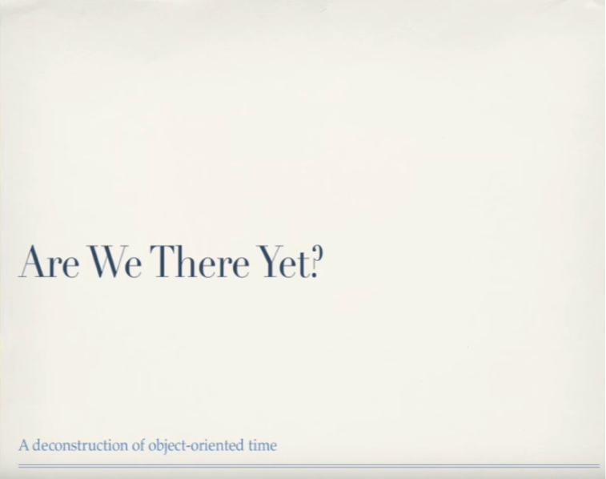
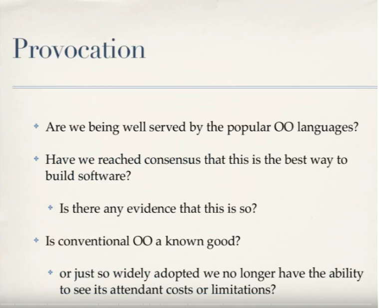
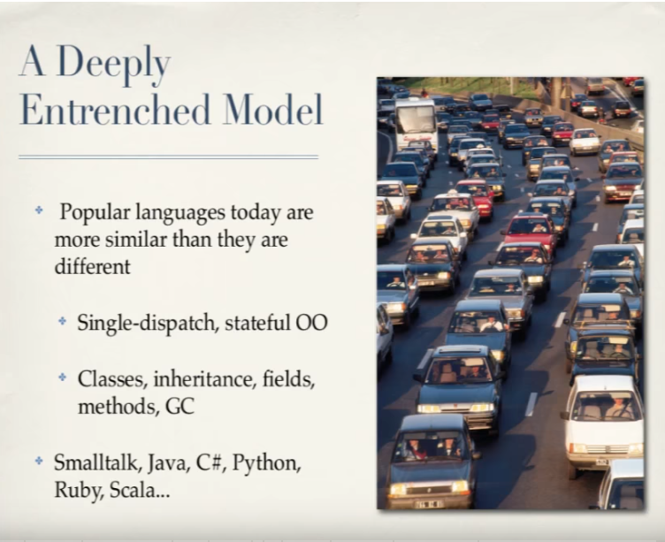
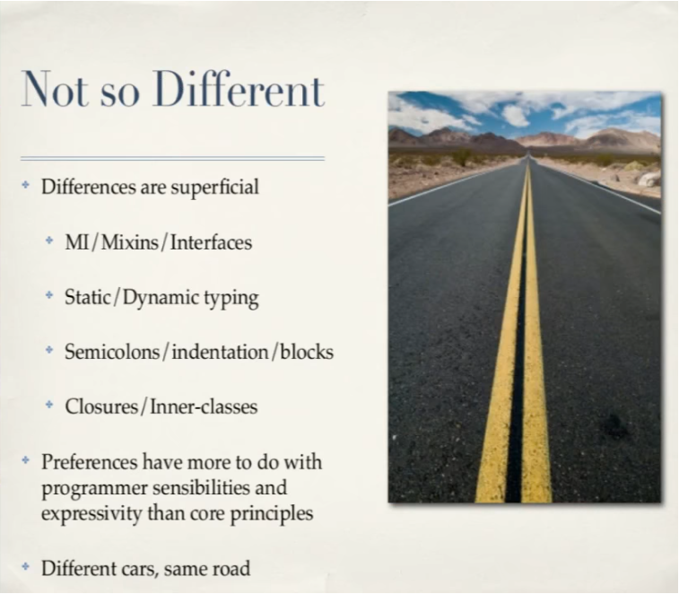
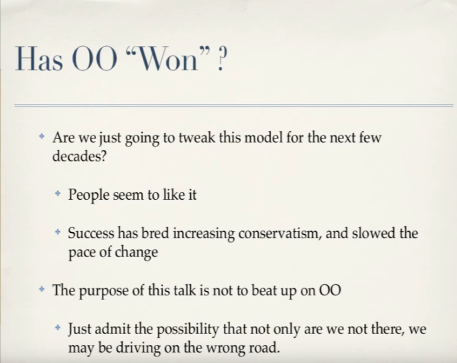
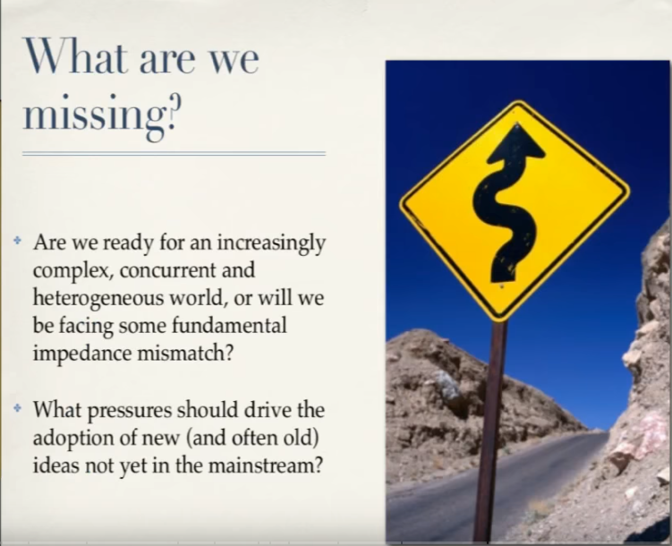
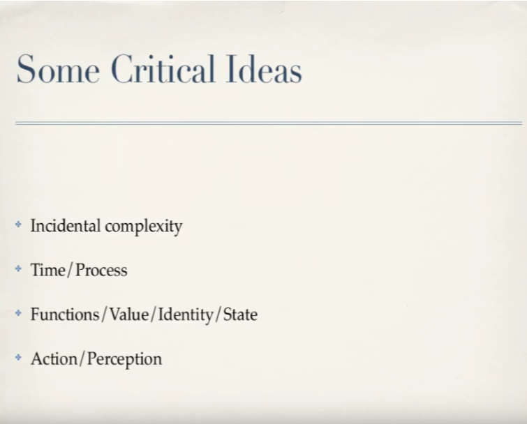
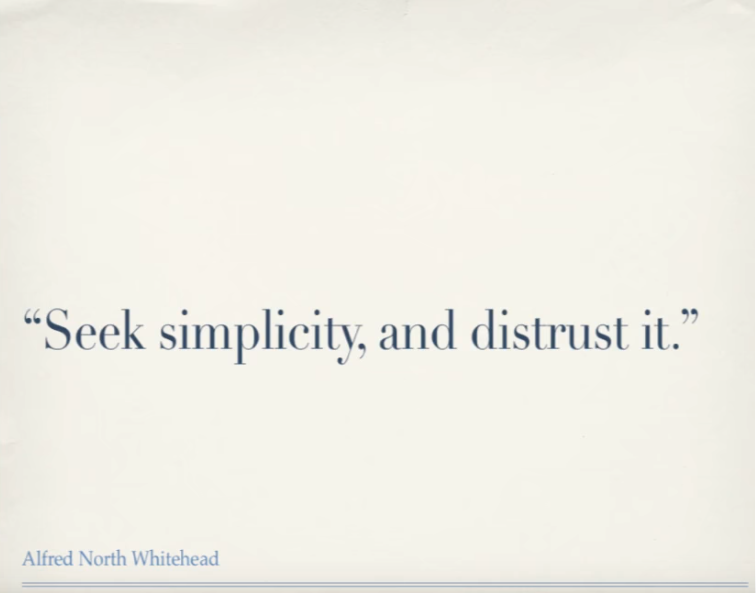

# Traduction et transcription de la conférence *Est-ce déjà la fin ? Une déconstruction de la perception du temps en tant qu'objet* de Rich Hickey

Titre original : Are We There Yet ?

[Lien vers la conférence](https://www.infoq.com/presentations/Are-We-There-Yet-Rich-Hickey/)

<!-- traductions possibles : Avons nous atteint notre but ? Est-ce déjà la fin de l'histoire ? Est-ce déjà la fin ? Sommes nous arrivés au bout ? -->

Version: 1.0

Date dernière mise à jour:

## *Est-ce déjà la fin ? Une déconstruction de la perception du temps en tant qu'objet* de Rich Hickey

Je vais parler du *temps* aujourd'hui. Plus particluièrement, de comment on gère le temps dans les langages orienté objet en général et peut-être de comment nous échouons à le faire.

<!--  -->

Mon but aujourd'hui est de vous provoquer, de vous pousser à reconsidérer des choses fondamentales avec lesquelles, je pense, nous sommes tellement en contact chaque jour que nous ne les voyons plus si bien que nous n'arrivons pas à prendre le recul nécessaire sur ce que nous faisons *vraiment*.

Donc, sommes nous bien équipés avec les langages OOP tels que nous les connaissons aujourd'hui ? Le concept est assez large, et il y a un certain nombre d'implémentations mais tous partagent un certain nombre d'attributs. Est ce que nous sommes tous d'accord qu'il s'agit là de la meilleure manière d'écrire des logiciels ? Est ce que ce sera la meilleure manière dans le futur ?

<!--  -->

A l'heure actuelle, il s'agit d'un modèle complètement retranché sur lui même. Peu importe le langage que vous utilisez, chaque langage a ses petites particularités comme Scala, Java, ou C# et les gens adorent les différences entre ces langages mais je voudrais que vous vous concentriez plutot sur les similarités entre ces langages. Tous ces langages sont single-dispatch, fondé sur des états gérés par des objets. Ils disposent tous des mêmes genres de choses: des classes, de l'héritage, des attributs (concept intéressant), des méthodes (encore plus intéressant, on y reviendra), ils disposent tous d'un ramasse-miettes. Ils ont tous pour ancêtre commun le langage SmallTalk.

<!--  -->

Tous ces langages ne sont pas significativement différents. Ils sont différents de manière superficielle. Ils peuvent avoir des mixins, des interfaces, être typés statiquement ou dynamiquement, etc. Mais aucun de ces aspects n'est vraiment important comparé à l'ADN commun qu'ils partagent. Tout le monde est excité car leur langage n'a pas de point virgules etc. Mais toutes ces différences ont plus à voir avec la sensibilité du programmeur, elles ne sont significatives quant au *modèle* de programmation qui reste toujours le même. Ce sont toutes des voitures différentes, mais elles roulent toutes sur la même route.

<!--  -->

Est-ce la fin ? Sommes nous arrivés au bout ? Allons nous continuer à inventer des langages qui n'évoluent que par des petites variations incrémentales infinitésimales par rapport aux choses que nous connaissons déjà ? Ce qui est indéniable, c'est que les gens aiment l'orienté objet. D'un autre côté, je pense qu'on est devenus profondémment conservateurs. Et c'est compréhensible, vous avez été recruté par des grandes entreprises, elles ont investi beaucoup dedans, les gens savent s'en servir etc. Ce n'est pas quelque chose dont on se sépare si facilement. 

Et je voudrais insister sur le fait que le but de cette présentation n'est pas de taper sur l'orienté objet, mais plutot de vous inviter à faire un pas de côté, que vous imaginiez que vous n'aimez pas l'orienté objet et que vous vous demandiez si c'est vraiment un modèle parfait.

<!--  -->

Quand nous regardons les langages et que nous nous disons "ah, si je pouvais écrire un autre langage" ou "si je pouvais faire quelque chose pour corriger ce langage", ou encore "si je pouvais ajouter une nouvelle fonctionnalité à mon langage", etc. que faisons-nous ? Pourquoi ajoutons nous quelque chose ? Qu'est ce qui nous pousse à faire des changements ? Qu'est ce qui nous pousse à changer de voiture par exemple ? Qu'est ce qui nous pousse à adopter un autre langage ? Et qu'est ce qui *devrait* nous pousser à changer ? Je ne pense pas qu'il y ait beaucoup de personnes qui disent "Oh, je suis fatigué des point-virgule, je ne peux plus en écrire. Je vais passer à quelque chose de plus simple". Je pense que le typage dynamique peut pousser des gens à changer mais je pense qu'il y a déjà des exemples dans l'Histoire qui illustrent ce qui nous pousse à changer. 

<!--  -->

Je vais donc parler aujourd'hui d'un petit sous-ensemble de choses auxquelles vous devriez penser quand vous regardez le langage que vous utilisez, et que vous vous demandez si vous ne pouvez pas faire autrement.

Je veux parler de complexité et de temps, surtout de la notion de temps. Enfin, je veux parler de modèles que nous pouvons utiliser pour mieux implémenter le temps et de certains des principes sur lesquels reposent l'orienté objet. L'orienté objet est une manière de modéliser, basé sur l'idée que nous pouvons faire des choses similaires dans nos programmes à ce que nous faisons, voyons dans la vraie vie, et que ça nous aide à comprendre nos programmes.

<!--  -->

Le héros de cette présentation est [Alfred North Whitehead](https://fr.wikipedia.org/wiki/Alfred_North_Whitehead), c'est le type célèbre qui avec [Russel](https://fr.wikipedia.org/wiki/Bertrand_Russell) à écrit [Principa Mathematica](https://fr.wikipedia.org/wiki/Principia_Mathematica). Par la suite, il est dévenu philosophe et il a écrit des super trucs et je vais en citer quelques passages, car ils sont tops. 

>Seek simplicity, and distrust it (Recherche la simplicité, et méfie en toi)

La première chose est de se méfier de la simplicité. Je ne parle pas ici de la complexité des problèmes que nous essayons de résoudre. Nous savons tous qu'on nous donne des problèmes de plus en complexes à résoudre, des problèmes toujours plus gros, avec toujours plus de données, pour lesquels la solution doit être de plus en plus flexible. Les gens vont toujours attendre davantage des logiciels. 

<!--  -->

La complexité dont je veux parler aujourd'hui est la *complexité circonstancielle* _(NDLR *incidental complexity* en anglais, que l'on pourrait également traduire par "résiduelle")_, la complexité qui naît de la manière dont nos outils, et les idées incarnées par ces outils, fonctionnent ou ne fonctionnent pas. Ces choses deviennent des problèmes que nous devons résoudre et vous avez un nombre limité d'heures par jour, et vous devez résoudre des problèmes. Est ce que ces problèmes à résoudre sont des problèmes du domaine d'application ou ceux que vous avez érigé vous même en choisissant tel outil, tel langage particulier ou telle stratégie de développement ? C'est ça la complexité circonstancielle, elle monte toujours à bord, elle ne fait pas partie du problème que vous essayez de résoudre. 

<!--Timecode: [5:35](https://youtu.be/E4RarTAZ2AY?t=335) -->

>La complexité circonstancielle la plus redoutable, c'est celle qui revêt l'apparence de la *simplicité*

Et c'est la pire je pense, on ne sait jamais quand on fait quelque chose de complexe, il n'y a pas un truc qui apparait soudainement et s'exclame "Arrg, complexe !", qui vous pousse à vous dire "Oh, d'accord je vois la complexité, elle est effrayante, je sais que je viens d'entrer dans une zone dangereuse, je dois rester prudent là dessus." La complexité circonstancielle la plus redoutable, c'est celle qui revêt l'apparence de la *simplicité*. "Regarde comment c'est facile, il n'y a pas de points-virgules etc.". Je ne dis pas ça pour critiquer les points-virgules, c'est juste quelque chose qui m'incite à regarder des aspects superficiels du langage que j'utilise, qui me pousse à me dire "ça à l'air simple, ça m'est familier" (*NDLR ici Rich Hickey ne semble pas vouloir aborder la distinction entre la simplicité et la facilité, un thème qu'il va approfondir dans sa conférence [Simple made Easy](https://www.youtube.com/watch?v=kGlVcSMgtV4)*). La question est de savoir est-ce que *derrière ces apparences* se cache une complexité circonstancielle ?

Prenons un exemple _(NDLR un exemple tiré du C++)_

~~~C++
Foo *bar(...){...}; //quel est le problème ?
~~~

et je le répète, je ne cherche pas à critiquer gratuitement le C++ mais j'ai passé plus d'une décennie à en faire... Bon, ce n'est pas si difficile, si vous êtes versé dans la [métaprogrammation avec des patrons](https://fr.wikipedia.org/wiki/M%C3%A9taprogrammation_avec_des_patrons) ça peut devenir difficile, mais les bases sont plutôt simples: vous pouvez écrire une fonction, elle retourne un pointeur. Qu'est ce qui ne va pas avec ça ? Parce que c'est plutôt simple: il y a `new` et `delete` _(NDLR new et delete sont des opérateurs de la librairie standard qui permettent d'allouer et de désallouer de la mémoire en C++)_, des pointeurs que vous pouvez faire circuler dans votre programme, les déférencer _(NDLR accèder à la valeur stockée à l'adresse mémoire stockée par le pointeur)_, etc. Vous avez besoin de connaître cinq choses au plus et vous pouvez les apprendre en une après-midi. 

Mais pour autant, est-ce *vraiment simple* ? Par exemple, la même syntaxe est utilisée pour les pointeurs qui font référence à des choses sur le [tas](https://fr.wikipedia.org/wiki/Tas_(allocation_dynamique)) et des choses qui ne sont pas sur le tas. Mais il y a pire, le vrai problème qui réside dans la signature de cette fonction c'est qu'est ce que vous faites du résultat qu'elle vous renvoie ? Est-ce que ça vous appartient ? En êtes vous responsable à présent ? Devez vous libérer la mémoire plus tard vous même _(NDLR utiliser l'opérateur `delete`)_ ? Est-ce quelque chose dont la mémoire peut être libérée ? Pouvez-vous le passer à quelqu'un d'autre ? Es-ce autorisé ? Pouvez vous l'enregistrer ? Le problème ici c'est qu'il n'y a pas de de gestion standardisée et automatique de la mémoire. Il n'y a pas de [ramasse-miettes](https://fr.wikipedia.org/wiki/Ramasse-miettes_(informatique)). Et pour celleux qui utilisent ce langage, ce problème était (et l'est toujours) une grande source de complexité circonstancielle. Car *vous* devez gérer la mémoire. Et vous ne le voyez pas immédiatement, il n'y pas un panneau dans l'en tête de votre code source qui vous avertit "N'oubliez pas qu'il est de votre responsabilité de gérer la mémoire!". C'est de la complexité circonstancielle, vous *devez le savoir*, ce n'est pas écrit dans le code source. 

Je pense d'ailleurs que l'absence de ramasse-miettes a sérieusement entravé un des objectifs principaux du C++, à savoir celui d'être un langage de [bibliothèque logicielle](https://fr.wikipedia.org/wiki/Biblioth%C3%A8que_logicielle) *(NDLR library language dans le texte)*. Toutes les intentions initiales du langage, toutes les interventions de [Stroustrup](https://fr.wikipedia.org/wiki/Bjarne_Stroustrup) (NDLR Bjarne Stroustrup est l'auteur du C++) etc., soulignent cette volonté du C++ de devenir un langage de bibliothèqe logicielle mais il a fini seulement par devenir un langage de bibliothèque étriqué. Car chacun dispose de sa propre bibliothèque, mais il n'existe toujours pas beaucoup de bibliothèques partagées entre différents acteurs à cause de ce problème. Et nous savons que Java, qui dispose d'un ramasse-miettes standard, a réussi à créer une grande infrastructure de bibliothèque logicielle. Je pense que ce qui a incité beaucoup de gens à migrer de C++ vers Java, en grande partie, est de ne plus avoir à porter le fardeau de cette complexité. "Je ne veux plus faire de gestion de mémoire manuelle, cela ne fait pas partie du problème que j'essaie de résoudre. C'est juste un problème de plus, qui m'est resservi jour après jour, dès que je me remets au travail. Et je n'en veux plus." 

<!-- Timecode: [8:45](https://youtu.be/E4RarTAZ2AY?t=525) -->

Bien, penchons nous sur le cas de Java justement:

~~~Java
Date foo(...){...}; //quel est le problème ?
~~~

C'est plus simple, il n'y a pas d'astérisque ! C'est mieux, donc quel est le problème ici ? C'est définitivement plus simple, à présent nous n'avons que des références à manipuler en ce qui concerne la gestion de la mémoire, et nous avons une gestion automatique de la mémoire, nous avons un ramasse-miettes. C'est vraiment, mais vraiment mieux. C'est beaucoup plus facile. Sauf que, à nouveau, nous avons cette complexité cachée: est-ce une chose [immutable](https://fr.wikipedia.org/wiki/Objet_immuable) ou non ? (NDLR: ce que retourne la fonction `foo` dans l'exemple ci-dessus, un objet de type `Date`) Si j'inspecte cette chose maintenant, et que je parcours ses champs, est ce que l'ensemble des choses que j'inspecte représente une valeur *cohérente* ? _(NDLR en anglais *consistent*, au sens systématiquement la même, cohérente avec elle même dans le temps)_. Il ne s'agit pas là simplement d'un problème propre à la [programmation concurrente](https://fr.wikipedia.org/wiki/Programmation_concurrente) (NDLR en programmation concurrente des zones mémoires, et donc des objets comme l'objet de type `Date`, peuvent être partagées entre différents processus), car il existe et c'est un problème sérieux, car même si on laisse de côté les [threads](https://fr.wikipedia.org/wiki/Thread_(informatique)) etc., cet exemple illustre une grande source de complexité circonstancielle, cachée dans nos programmes: nous ne savons pas quand nous avons une valeur stable _(NDLR dans le temps)_. Est ce que je peux stocker cette date quelque part, la ressortir plus tard et être certain·e de revoir ce que j'ai vu au moment où on me l'a passé ? Non, vous ne pouvez pas l'affirmer. D'ailleurs, si vous passez une date ou une chose mutable à quelqu'un - je sais les choses mutables ont été dépréciées concernant les dates en Java mais peut importe, mon but n'est pas de taper sur les dates en Java - et que cette personne la passe à quelqu'un d'autre etc. et que vous devez la changer, qui sera affecté par ce changement ? Vous ne pouvez *pas* le savoir. Donc ça *a l'air* très facile, et ce n'est pas que Java, ce problème concerne tous les langages qui autorise les objets mutables et il n'y a aucun moyen de le corriger. Donc quel est le problème ici ? Je le formulerai ainsi: nous n'avons *aucune gestion standardisée du temps*. Cela peut vous paraître confus pour le moment mais j'espère éclaircir rapidement ce que j'entends par là.

>La familiarité masque la complexité.

Donc, pour résumer un peu les points abordés précedemment, je pense que parce que toutes ces choses nous sont *si familières* nous ne les voyons plus. Et quand nous choisissons des langages, ou que des gens choisissent des langages, la plupart du temps ils prennent leurs décisions en se basant sur des différences vraiment superficielles comme la syntaxe, ou "cette expressivité me plaît" etc. Et j'admets volontiers que ces sensibilités sont réelles, elles existent et font sens mais elles concernent davantage nos émotions. En attendant, nos systèmes deviennent de plus en dur à construire, à maintenir et à se comporter correctement. Et cela est du, en grande partie, à cause de cette complexité circonstancielle. Nous ne pouvons comprendre des grands programmes, nous avons ces grands ensembles de tests que nous appliquons à chaque fois que l'on n'apporte ne serait-ce qu'une petite modification. Car nous ignorons si en changeant quelque chose ici, nous n'avons pas cassé quelque chose à un autre endroit. Et nous ne *pouvons pas* en être sûr. Pour moi et pour d'autres personnes, la programmation concurrente est la goutte d'eau qui fait déborder le vase en ce qui concerne cette complexité.

Nous sommes des programmeur·ses, nous n'utilisons plus des [langages Assembleur](https://fr.wikipedia.org/wiki/Assembleur), nous avons des langages. A chaque fois que nous construisons des nouveaux langages nous nous attendons à obtenir quelques avantages vis à vis de ces problèmatiques. Nous voulons masquer des pans entiers de trucs, les nommer, les encapsuler et les mettre hors de vue, pour ne plus y penser et sur lesquels on peut construire dse choses. Quand vous prenez quelqu'un qui construit une maison avec des briques, il n'a pas besoin de se soucier de ce qu'il se trouve *à l'intérieur* d'une brique. Elles ont certaines propriétés macroscopiques, elles sont calibrées pour répondre à certains besoins, etc. Et l'argument de vente de la [programmation orientée objet](https://fr.wikipedia.org/wiki/Programmation_orient%C3%A9e_objet) était justement de fabriquer ces éléments que nous pouvons combiner pour fabriquer des programmes faciles à comprendre _(NDLR comme les briques)_, car nous comprenons chaque élément, pour fabriquer des grands systèmes compréhensibles en assemblant ces parties. Il s'avère qu'au final, ce n'est pas le meilleur élément _(NDLR les objets mutables)_ pour y parvenir. Les meilleurs candidats pour y arriver sont les fonctions, et en particulier les [fonctions pures](https://fr.wikipedia.org/wiki/Fonction_pure). 

>Les fonctions pures devraient être les *briques* à utiliser pour construire nos programmes, car elles sont les *éléments* que nous pouvons manipuler sans que nous ayons à nous soucier de quoi que ce soit.

Si vous voulez manipuler quelque chose dont vous n'avez pas à vous soucier, vous devriez aimer les fonctions pures. Une fonction pure prend  une valeur immuable, fait quelque chose avec -- ce qu'elle fait n'a aucune conséquence sur le reste du monde -- et elle retourne une autre valeur immutable. Donc l'entièreté de son périmètre d'action est local. Une fonction pure n'intègre et n'a aucune notion de temps (ce point est important pour plus tard). Une fonction pure est clairement facile à comprendre, facile à changer. Elle possède une [signature](https://fr.wikipedia.org/wiki/Signature_de_type) _(NDLR c'est son interface, sa partie publique, connue du reste du programme)_, la seule chose connue par les autres. Si nous changeons ce qu'il y a à l'intérieur, personne ne s'en soucie et n'a à s'en soucier. Les fonctions pures devraient être les *briques* à utiliser pour construire nos programmes, car elles sont les éléments que nous pouvons manipuler sans que nous ayons à nous soucier de quoi que ce soit. Il y a de grands bénéfices à tirer de cette approche. Vous pourriez facilement le faire dans les langages orientés objet mais les gens ne le font pas. Contrairement aux fonctions pures, les objets et les méthodes n'ont pas ces propriétés désirables, ils n'ont pas la propriété "je n'ai pas à m'en soucier", clairement pas. Nous allons voir pourquoi dans un instant. 

D'un autre côté, même si les fonctions pures font de très bonnes briques, nos programmes, de manière générale, ne sont pas des *fonctions* *(NDLR au sens mathématique, une fonction pure)*. Il y a des programmes qui sont des fonctions comme les compilateurs, les [démonstrateurs automatiques de théorème](https://fr.wikipedia.org/wiki/D%C3%A9monstration_automatique_de_th%C3%A9or%C3%A8mes), etc., les programmes qui, de manière générale, convertissent quelque chose en une autre. Mais la plupart des programmes tournent sur des périodes indéfiniment longues, les gens en attendent certains résultats ou comportements, ou de pouvoir leur fournir des données en entrée pour obtenir des réponses différentes à chaque fois. Je ne veux pas que Google me fournisse le même résultat à chaque fois que je tape le même mot. Google ne m'intéresserait pas dans ce cas. Si Google était une *fonction*, ce serait nul. Google est un processus, il est connecté au reste du monde, il examine toutes les pages web, les intègre à sa base de données via des algorithmes (qui doivent également pouvoir changer) etc. Pris dans son ensemble, Google ressemble plus à une chose participant au monde qu'à une fonction. Ce que retourne Google n'est pas le résultat d'un calcul idéalisé. On peut donc dire que le programme pris dans son ensemble possède un comportement que nous pouvons observer au cours du temps, bien que vous verrez je n'aime pas le terme *comportement*. Donc la plupart des programmes sur lesquels travaillent les gens dans l'industrie sont en fait des processus. 

>That 'all things flow' is the first vague generalization which the unsystematized, barely analyzed, intuition of men has produced. (Whitehead) 

>Ce *flot continu de choses* est la première généralisation, plutôt vague, qu'a produite l'intuition humaine, encore dépourvue de cadre de pensée précis ou de système d'analyse.

Peut-être que nous n'avons pas encore compris la valeur des fonctions (je suis certain qu'on n'en a pas encore eu l'occasion) mais nous avons clairement vu leurs limites. L'orienté objet était une manière de dire ouais, les fonctions c'est très bien mais pour les calculs et tout, mais dans le vrai monde il y a des objets, il y a des interfaces graphiques, il y a des *choses*, etc. L'orienté objet était une tentative de transformer nos schémas mentaux en processus que nous observons dans le monde et de les incarner dans un modèle de programmation. L'essence de l'approche orientée objet ce n'est pas l'encapsulation blablabla, c'est ce *comportement*, ce truc qui ressemble à un flot de choses. C'est à dire nous avons ces entités que nous voyons faire des choses dans le monde, nous devons donc avoir ces entités qui font des choses dans nos programmes. Donc la première chose que nous devons réaliser c'est que tout modèle de programmation qui essaie de modéliser le monde réel sera forcémment un modèle simple. Mais à nouveau, méfiez vous de la simplicité. Un des problèmes qu'a l'orienté objet avec la notion de temps c'est que nous parlons de comportements, d'états, etc. alors que ces termes sont mal définis et ne véhiculent presque aucun sens. Ajouté à cela, les objets qui sont sensés être *à propos* de processus n'embarquent aucune notion concrète de temps. Il n'y a pas plus de notion de temps dans les objets qu'il y en a dans les fonctions. Au moins les fonctions ne font pas semblant de jouer avec le temps. Les fonctions disent "le temps n'existe pas, j'ai mes entrées, mes sorties, je ne prétends pas avoir de lien avec le temps". Les objets feignent de gérer la notion de temps et pour autant nos systèmes composés d'objets n'ont aucune notion [réifiée](https://fr.wiktionary.org/wiki/r%C3%A9ifier) du temps _(NDLR réifier, qui veut dire transformer quelque chose en une chose matérielle, signifie transformer un concept en une implémentation, en *unité logicielle manipulable*)_. Il n'existe rien pour parler explicitement du temps. 

La raison c'est que la plupart des langages orientés objet sont nés à une époque où votre programme pilotait l'ordinateur, vous aviez un flot d'éxecution unique et monolitique, une timeline, un processus unique qui contrôlait tout le reste. Maintenant que ce n'est plus le cas, nous essayons d'utiliser des verrous pour restaurer cette vision du monde, mais cette vision du monde n'a jamais été correcte. Et vous pouvez vous en rendre compte de cette manière: nous ne disposons toujours pas de représentations concrètes et utilisables pour la *perception* (est ce que je peux regarder quelque chose ?) et pour la *mémoire* (est ce que je peux me souvenir de cela ?). Car les objets sont tous *live*, ce sont tous des bombes à retardement. On s'est complètement trompés, l'orienté objet s'est trompé sur le temps, et il s'est trompé là dessus de plusieurs manières. La première c'est que nous avons fait des objets qui peuvent changer *sur place* _(NDLR un objet qui peut être modifié sur place est mutable et n'est pas définition pas une valeur. Cela revient à manipuler un emplacement mémoire)_. Et nous avons fait des objets que nous pouvons *voir* changer sur place. Comme je l'ai déjà dit, nous avons laissé de côté toute notion concrète de temps et il n'y a pas de notion bien définie de *valeur* (NDLR pour mieux comprendre la notion de valeur, vous pouvez regarder la conférence [The Value of Values[vostfr]](https://www.youtube.com/watch?v=VJi1vOwu2SM&t=1344s) donnée par Rich Hickey). Vous pouvez fabriquer des valeurs, vous *pouvez* faire une classe dont tous les composants sont immutables et elle permettrait de fabriquer des valeurs, mais il n'y a pas de notion bien définie de valeur dans la plupart de ces langages.

<!-- [18:41](https://youtu.be/E4RarTAZ2AY?t=1121) -->

## Bibliographie

- [Are we there yet ?](https://www.youtube.com/watch?v=E4RarTAZ2AY&t=3299s), enregistrée en 2009, au Sun JVM Languages Submit, filmée en partenariat avec [InfoQ.com](https://www.infoq.com/). La source de cette transcription.
- [Simple made Easy](https://www.youtube.com/watch?v=kGlVcSMgtV4), enregistrée en 2011, mise à disposition par [InfoQ.com](https://www.infoq.com/)

## Auteur

Paul Schuhmacher

site web: <a href="pschuhmacher.com">pschuhmacher.com</a>

contact: <a href="mailto:contact@pschuhmacher.com">contact@pschuhmacher.com</a>